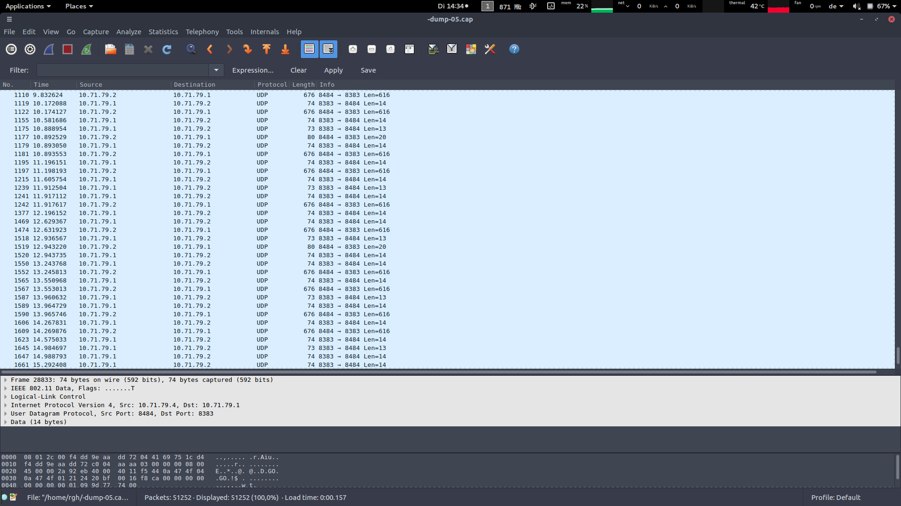

# GoPro Smart Remote access point packet sniffing using aircrack-ng.
## This document will describe the process to perform packet sniffing on the Smart Remote access point when multiple GoPro's are connected to it.

### Equipment needed
1. A Smart Remote device.
2. One or more GoPro's which are compatible with the said Smart Remote device.
3. A modern laptop/computer (modern is important because many laptops won't have a wireless interface that is capable of "monitor mode") that is running Linux (Linux is important because Windows has fleeting support of aircrack-ng). I am using a ThinkPad T470 with Aircrack-ng 1.2 beta3.

### Steps
1. Install Aircrack-ng (either compile from source or download built in binaries for your distro). Look [here](https://www.aircrack-ng.org/doku.php?id=getting_started) for additional details.

2. After installation, run the following command (run all commands mentioned in these steps as root unless specified otherwise). This tells you about your wireless interface.

       root@arrakis:~# airmon-ng

       Interface	Chipset		Driver

       wlp4s0		Intel AC	iwlwifi - [phy0]

3. Next do:

       root@arrakis:~# airmon-ng check kill

       Found 5 processes that could cause trouble.
       If airodump-ng, aireplay-ng or airtun-ng stops working after
       a short period of time, you may want to kill (some of) them!

       PID	Name
       1001	avahi-daemon
       1022	avahi-daemon
       1083	NetworkManager
       1612	wpa_supplicant
       25466	dhclient
       Process with PID 25466 (dhclient) is running on interface wlp4s0
       Killing all those processes...

     At this stage you will notice that your WiFi manager is turned off. This is expected.   
4. Now we are ready to set up a monitoring interface.

       root@arrakis:~# airmon-ng start wlp4s0

       Found 2 processes that could cause trouble.
       If airodump-ng, aireplay-ng or airtun-ng stops working after
       a short period of time, you may want to kill (some of) them!

       PID	Name
       6684	avahi-daemon
       6685	avahi-daemon

       Interface	Chipset		Driver

       wlp4s0		Intel AC	iwlwifi - [phy0]
				(monitor mode enabled on mon0)

5. Alternatively, if there is trouble, please use [this](https://taufanlubis.wordpress.com/2010/05/14/how-to-fix-ioctlsiocsiwmode-failed-device-or-resource-busy-problem/) resource to start monitor mode on your wireless interface.
6. Next we use airodump-ng on the monitoring interface.

       root@arrakis:~# airodump-ng wlp4s0
       CH  6 ][ Elapsed: 2 mins ][ 2019-04-23 14:00                                         

       BSSID              PWR  Beacons    #Data, #/s  CH  MB   ENC  CIPHER AUTH ESSID

       20:37:06:6C:88:7C  -55     1175      553    0  11  54e  OPN              tu-chemnitz.de                      
       F4:DD:9E:AA:DD:72  -23        3        0    0  11  54 . OPN              HERO-RC-A1111425450879              
       20:37:06:6C:9A:21  -54        3        0    0   6  54e. WPA2 CCMP   MGT  lab                                 
       20:37:06:6C:9A:24  -54        0        0    0   6  54e. WPA2 CCMP   PSK  tuc-special                         
       20:37:06:6C:9A:20  -55        0        0    0   6  54e. WPA2 CCMP   MGT  eduroam                             
       20:37:06:6C:9A:23  -55        3        0    0   6  54e. OPN              tu-chemnitz.de            

       BSSID              STATION            PWR   Rate    Lost    Frames  Probe                                    

       20:37:06:6C:88:7C  BC:A8:A6:BF:84:75    0    0e-12e     0      555                 
      If there is trouble doing this step, please look [here](https://uwnthesis.wordpress.com/2013/07/26/kali-how-to-fix-ioctlsiocsiwmode-failed-device-or-resource-busy-problem/).
7. Now comes the final step where we dump the data in which we are interested to a file. You will need to identify the BSSID and note the channel number of the GoPro Smart Remote access point. Using that information, you will need to issue the following command:
       root@arrakis:~# airodump-ng -c 11 --bssid F4:DD:9E:AA:DD:72 -w -dump wlp4s0

8. This should lead to .pcap files getting generated on your hard drive (same folder from where you issued the commands). You can use a graphycal tool like Wireshark to analyze the data:

### References
1. https://www.aircrack-ng.org/doku.php?id=airmon-ng
2. https://www.aircrack-ng.org/doku.php?id=airodump-ng
3. https://www.aircrack-ng.org/doku.php?id=getting_started
